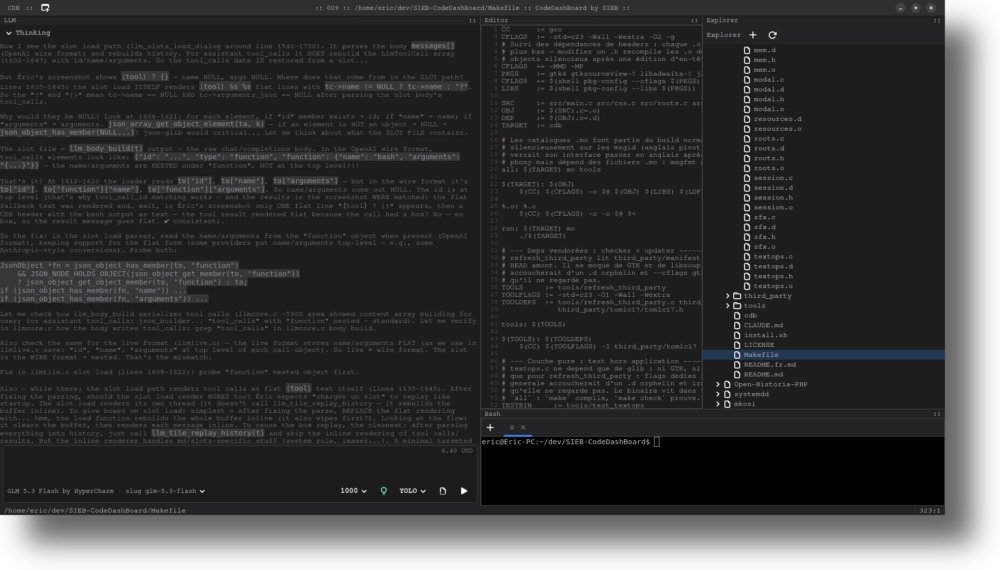
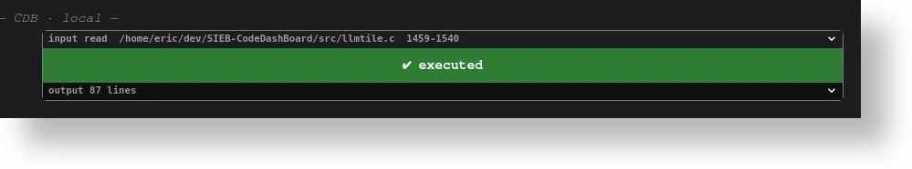
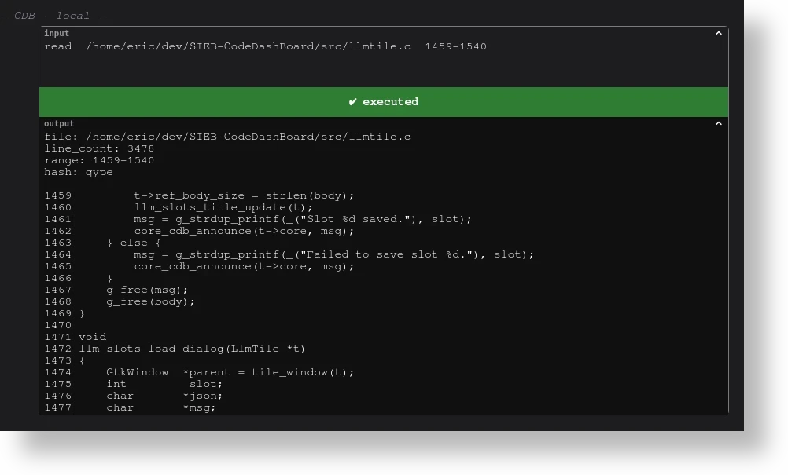
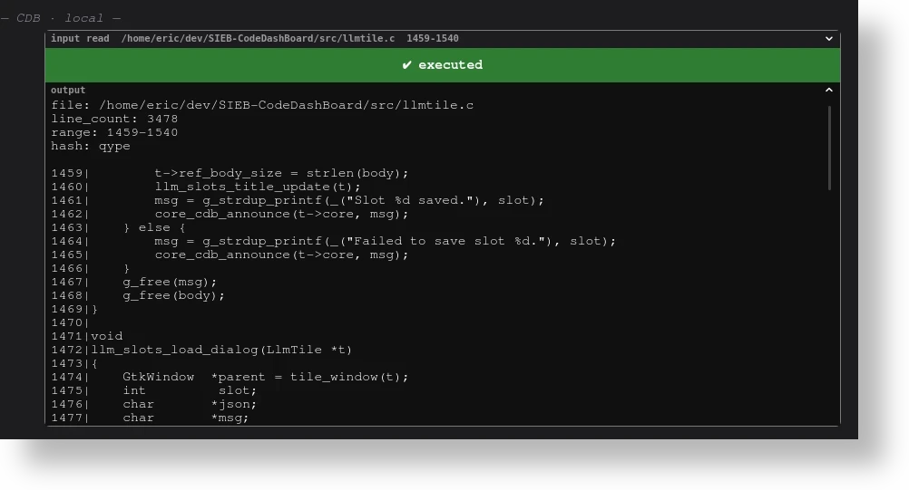
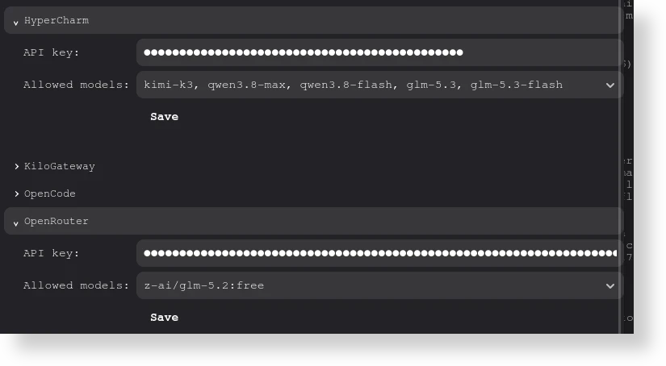
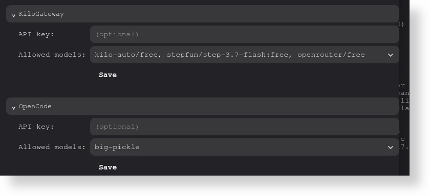
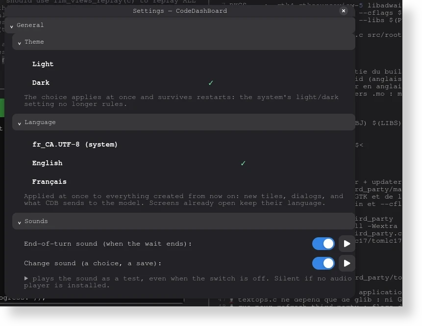
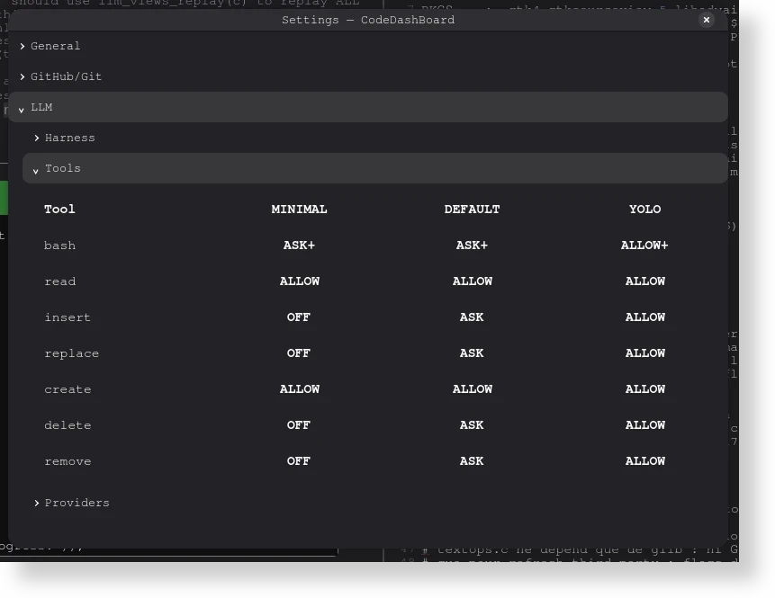

<p align="center">
  <picture>
    <source srcset="resources/svg/banner-light.svg" media="(prefers-color-scheme: dark)">
    
  </picture>
</p>

<p align="center"><strong>The lightweight AI-oriented IDE.</strong></p>

<p align="center">
  <a href="LICENSE"></a>
  
  <a href="https://gtk.org"></a>
  
</p>

<p align="center">
  English | <a href="README.fr.md">Français</a> | <a href="po/README.md">Add your language</a>
</p>

<p align="center">
  
</p>

> **No Electron. No bloat.** A GTK4 IDE written in C23, aiming at ≤128 MiO
> of RAM — and a conversation thread that renders 100 000 lines at 0,0 ms.
> Measured, not hoped.

---

### A tour of the UI

**The interactive box, in three states.** A request folds away, the decision
always shows in full — green or red — and the answer arrives complete, white
on black like a terminal. The thread is a lazy GtkTextView: 100 000 lines
render in 0,0 ms, where a GtkLabel needs 62 seconds. Nothing is ever
truncated.

<p align="center">
  
  
  
</p>

**Your provider, with or without a key.** OpenRouter, OpenCode Zen,
HyperCharm and KiloGateway ship pre-wired — adding one is a single line.
The form greets you either way.

<p align="center">
  
  
</p>

**Two menus, zero chrome.** The tool preferences ride two clicks from the
thread — modes included, plumbing excluded.

<p align="center">
  
  
</p>

### Quick install

```sh
curl -fsSL https://raw.githubusercontent.com/Eric1212/SIEB-CodeDashBoard/master/install.sh -o install.sh
bash install.sh
```

> [!WARNING]
> The usual pipe-to-shell caveat applies: the script is readable — **read
> it before running it**. It never uses `sudo` and never installs anything:
> if dependencies are missing, it prints the package-manager command for
> your distro and exits. You run that command yourself, then re-run the
> script (or just `make`).

### Installation

```sh
git clone https://github.com/Eric1212/SIEB-CodeDashBoard.git
cd SIEB-CodeDashBoard

make run   # builds, then launches — the one-shot way
# or, in two steps:
make       # builds ./cdb and the .mo catalogs
./cdb      # runs it from the build tree

# or, install system-wide — desktop entry + icons (needs rsvg-convert):
sudo make install     # then start CDB from the app menu; undo: sudo make uninstall
```

#### Non-Linux (Windows & macOS)

##### Windows (WSL2)

**WSL2** — CDB is a GTK4 app; run it like any GUI app under WSLg, the
Wayland/X11 layer included in WSL2 (Windows 11 in-box, or the Microsoft
Store WSL on Windows 10). First time with WSL? From an **administrator**
PowerShell:

```powershell
wsl --install            # WSL2 + Ubuntu (default); reboot, then pick a
                         # username/password inside the distro
wsl --install -d Debian  # any distro — wsl --list --online to browse
```

Debian on the Store: <https://apps.microsoft.com/detail/9msvkqc78pk6> (publisher: The Debian Project).

From that Debian shell on, treat CDB exactly as on a native Debian or
Ubuntu install — `install.sh` included, `sudo make install` too (WSLg even
surfaces the desktop entry in the Windows Start menu).

##### macOS (Homebrew)

**macOS (Homebrew)** — build from source against Homebrew's GTK4 stack:

```sh
brew install gcc pkgconf gettext make gtk4 gtksourceview5 libadwaita \
  json-glib vte3 libsoup librsvg
make run   # builds, then launches — the one-shot way
# or, in two steps:
make       # pkg-config finds the kegs through PKG_CONFIG_PATH
./cdb      # no XQuartz needed: GTK4 renders natively on macOS
```

GTK4 renders natively on macOS — no XQuartz needed. Stop there: `sudo make
install` is XDG/Linux-only — /usr is SIP-protected, and .desktop entries mean
nothing there.

#### Dependencies

A C23 toolchain (gcc 15 recommended) and the GTK4 stack. The pkg-config
names CDB looks for: `gtk4`, `gtksourceview-5`, `libadwaita-1`,
`json-glib-1.0`, `vte-2.91-gtk4`, `libsoup-3.0`.

```sh
# Debian / Ubuntu
sudo apt install build-essential gcc-15 pkg-config gettext git \
  libgtk-4-dev libgtksourceview-5-dev libadwaita-1-dev \
  libjson-glib-dev libsoup-3.0-dev libvte-2.91-gtk4-dev librsvg2-bin

# Fedora
sudo dnf install gcc make pkgconf gettext git gtk4-devel gtksourceview5-devel \
  libadwaita-devel json-glib-devel vte291-gtk4 libsoup3-devel librsvg2-tools

# Arch
sudo pacman -S --needed base-devel gtk4 gtksourceview5 libadwaita \
  json-glib libsoup3 vte4 librsvg
```

#### Make

| Target | What it does |
|---|---|
| `make` | builds `./cdb` and the tools |
| `make run` | builds, then launches |
| `make install` / `make uninstall` | desktop entry + icons, or remove them |
| `make asan` | AddressSanitizer + UBSan build |
| `make check` | test suite |
| `make pot` / `po` / `mo` / `i18n-check` | translation pipeline: regenerate, merge, compile, verify |
| `make clean` | sweep the build tree |

### Debug

```sh
CDB_DEBUG=1 ./cdb   # dump allocations + theme at startup
```

### Documentation

Build targets live in the [Makefile](Makefile); the translation workflow, in
[po/README.md](po/README.md). The source under [src/](src) is the final reference.

### Contributing

Found a bug or missing a feature? [Open an issue](https://github.com/Eric1212/SIEB-CodeDashBoard/issues) — bug reports and feature requests are both welcome.

Translations are the other open door: see [po/README.md](po/README.md) — add your
language to `LINGUAS`, `make po`, translate, `make mo`; the selector reads the
disk, nothing to code. For the rest, CDB is under a custom SIEB license: read
[LICENSE](LICENSE) first — it sets specific terms on derivative works and commercial use.

---

**CodeDashBoard (CDB)** by SIEB · <eb@sieb.ca> · [github.com/Eric1212/SIEB-CodeDashBoard](https://github.com/Eric1212/SIEB-CodeDashBoard)
